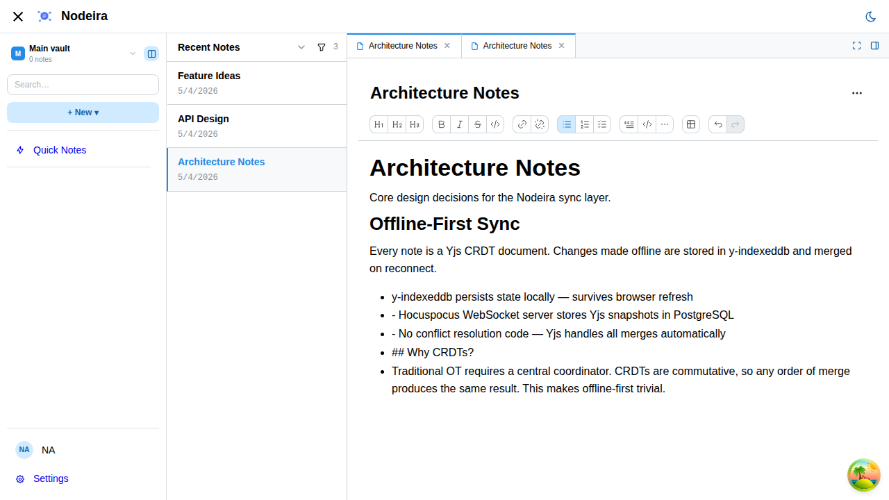
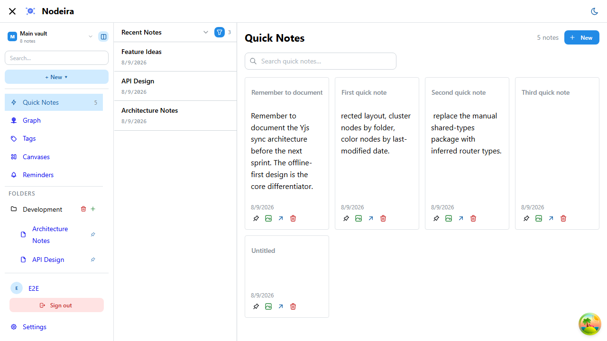

<div align="center">
  

  <h1>Nodeira</h1>

> **⚠️ Early Development — Please do not use this project yet.** It is under active development, is not stable, and is not ready for any real use. Breaking changes happen frequently with no migration path.

[](https://Nodeira.github.io/nodeira/)
[](https://github.com/Nodeira/nodeira/releases)
[](https://github.com/Nodeira/nodeira/actions/workflows/release.yml)
[](LICENSE)

</div>

An Obsidian-like, AI-enhanced note-taking application. Notes sync offline-first via Yjs CRDTs and are accessible to AI agents through CLI skill tool calls — making Nodeira a persistent "mind" for storing context across software development workflows.

## Screenshots

| Note Editor                                                    | Quick Notes                                                    |
| -------------------------------------------------------------- | -------------------------------------------------------------- |
|  |  |

## Features

- Rich-text editing powered by TipTap + Yjs (offline-first, conflict-free sync)
- Real-time collaboration via WebSocket (Hocuspocus / y-websocket)
- Bidirectional note links and graph view _(planned)_
- Canvas for research and brainstorming _(planned)_
- AI skill tool integration — CLI agents can read and write notes directly _(planned)_
- Plugin architecture with AI-optimized storage formats _(planned)_
- Multi-vault support with folder organization
- Note kinds: plain notes, tasks with Kanban view
- Pinned notes, recent view, per-note metadata and properties

## Tech Stack

- **Monorepo:** Turborepo + pnpm workspaces
- **Backend:** NestJS 10, Prisma ORM, PostgreSQL, Hocuspocus (Yjs WebSocket)
- **Frontend:** React 19, Vite 6, TanStack Router, TanStack Query v5, Mantine v9, TipTap + Yjs
- **Docs:** Docusaurus 3

## Quick Start

### Self-host with Docker Compose

```bash
git clone https://github.com/Nodeira/nodeira.git
cd nodeira
cp docker-compose.example.yml docker-compose.yml
```

Edit `docker-compose.yml` — replace both `CHANGE_ME` values with a strong database password and a random JWT secret (`openssl rand -hex 32`). Then:

```bash
docker compose up -d
docker compose exec nodeira pnpm exec prisma migrate deploy
```

Open `http://localhost:3001`. On first visit you will be directed to the setup page to create your admin account.

### Development setup

**Prerequisites:** Node.js 22+, pnpm, PostgreSQL (or Docker).

```bash
# Start PostgreSQL
docker compose -f docker-compose.dev.yml up -d

# Clone and install
git clone https://github.com/Nodeira/nodeira.git
cd nodeira
pnpm install

# Configure the server
cp apps/api/.env.example apps/api/.env
# Edit apps/api/.env — set JWT_SECRET (openssl rand -hex 32)
cd apps/api && pnpm exec prisma migrate dev && cd ../..

# Start all dev servers (web :5173, server :3001, docs :3002)
pnpm run dev
```

Electron app launch:

```
  1. API server (already need this running anyway):
  pnpm exec turbo run dev --filter=@nodeira/api

  2. Web dev server (Electron loads http://localhost:5173 in dev mode):
  pnpm exec turbo run dev --filter=@nodeira/web

  3. Electron (once the web server is up):
  pnpm --filter @nodeira/desktop run start

  ---
  One prerequisite first — better-sqlite3 is a native addon and pnpm blocked its build scripts during install (you saw the "run pnpm approve-builds" prompt). Run this once:

  ! pnpm approve-builds

  Then reinstall so the postinstall rebuild runs:
  ! pnpm install

  After that, pnpm --filter @nodeira/desktop run start will bundle the main + preload via Vite and launch the Electron window pointing at your web dev server.
```

Open `http://localhost:5173`. On first visit you will be directed to the setup page to create your admin account.

For full configuration and deployment docs, see the **[documentation](https://Nodeira.github.io/nodeira/)**.

## Browser Notes

**Brave Browser:** Brave's Shields feature includes canvas fingerprinting protection that interferes with the Graph View's click detection. If nodes in the graph are not clickable, disable Shields for your Nodeira instance (click the Brave lion icon in the address bar → toggle Shields off). This is safe to do for a self-hosted app on your own server.

## Commits

This project uses [Conventional Commits](https://www.conventionalcommits.org/). Releases are automated — pushing to `main` triggers semantic versioning and a GitHub release based on commit types.

| Prefix                                            | Effect                      |
| ------------------------------------------------- | --------------------------- |
| `feat:`                                           | Minor version bump, release |
| `fix:`                                            | Patch version bump, release |
| `BREAKING CHANGE`                                 | Major version bump, release |
| `chore:`, `docs:`, `style:`, `refactor:`, `test:` | No release                  |

## License

MIT
